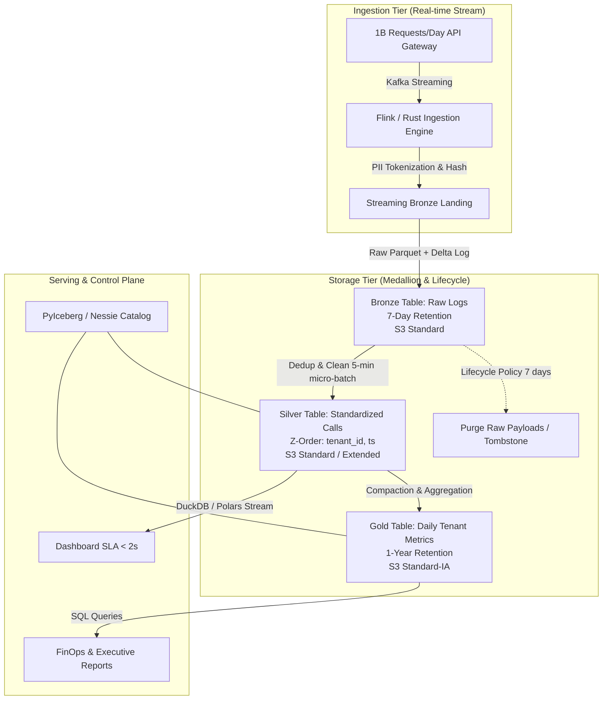

# Architecture Brief: LLM Observability Lakehouse at 1B Requests/Day Scale

- **Tác giả:** Đỗ Đình Hoàn (MSSV: 02377)
- **Mã bài lab:** `K4-Track02-Day18`
- **Topic lựa chọn:** Topic A — LLM Observability ở quy mô 1B requests/ngày

---

## 1. Problem Statement

Hệ thống quản lý 1 tỷ request LLM mỗi ngày cho dịch vụ Foundation Model API. Mỗi request sinh ra trung bình 5 KB dữ liệu log (bao gồm prompt, response, latency, token count, tenant metadata), tương đương **5 TB/ngày dữ liệu thô (150 TB/tháng)**. 

### Ràng buộc kinh doanh & kỹ thuật:
1. **Real-time Dashboard:** Cung cấp latency (p50, p95, p99) và chi phí theo `tenant_id` với chu kỳ refresh 5 phút (SLA latency < 2s).
2. **Audit & Incident Review:** Lưu giữ toàn bộ prompt/response trong 7 ngày để xử lý sự cố, sau đó tự động purge và chỉ giữ dữ liệu tổng hợp (aggregates) trong 1 năm.
3. **Bảo mật PII:** Redact/Tokenize tất cả thông tin định danh cá nhân (email, SĐT, API key, JWT) trước khi ghi vào kho lưu trữ có thể truy vấn.
4. **Cap ngân sách FinOps:** Tổng chi phí hạ tầng (Storage + Compute) không vượt quá **\$5,000/tháng**.

---

## 2. Architecture Diagram

### Áp dụng các Khái niệm Day 18:
1. **Medallion Architecture (Bronze -> Silver -> Gold):** Bronze lưu trữ thô đã tokenize PII; Silver loại bỏ trùng lặp và Z-Order theo `tenant_id`; Gold lưu dữ liệu tổng hợp theo ngày và model.
2. **Z-Order Clustering & File Pruning:** Cluster dữ liệu Silver theo `(tenant_id, date)` để đáp ứng query p95 < 2s mà chỉ cần đọc < 5% số file.
3. **Partition Evolution & Catalog Control Plane:** Sử dụng Apache Iceberg catalog để thực hiện hidden partitioning `day(ts)` mà không bắt người dùng phải hardcode predicate `ts_day` trong SQL.
4. **Maintenance & Snapshot Expiry:** Thiết lập tự động job `expire_snapshots` và `vacuum` để thu hồi dung lượng đĩa từ các partition > 7 ngày.

---

## 3. Quyết định Kiến trúc & Lựa chọn bị loại (Key Decisions & Tradeoffs)

### Quyết định 1: Định dạng bảng lưu trữ (Table Format) — Chọn Apache Iceberg
- **Lý do chọn:** Iceberg hỗ trợ **Hidden Partitioning** và **Partition Evolution** vượt trội, cho phép đổi spec partition từ `day(ts)` sang `hour(ts)` khi lưu lượng tăng mà không phải ghi lại (rewrite) dữ liệu cũ.
- **Loại bớt Alternative 1 — Apache Hive Format:** Hive bắt buộc dùng explicit directory partitioning (`/year=/month=`), vướng lỗi tốn chi phí scan directory trên S3 và rất dễ gây sai sót query từ phía client.
- **Loại bớt Alternative 2 — Standard JSON/Parquet Files:** Không có transaction log (ACID), vướng lỗi đọc dở dang (partial read) khi stream file và không hỗ trợ schema evolution.

### Quyết định 2: Chiến lược Tokenize PII — Tokenize tại Bronze Ingestion Engine
- **Lý do chọn:** Thực hiện Regex + HMAC-SHA256 Tokenization ngay tại lớp Flink Stream trước khi append vào Bronze Delta/Iceberg log. Đảm bảo dữ liệu PII không bao giờ xuất hiện ở dạng plaintext trên đĩa.
- **Loại bớt Alternative 1 — Masking tại Query Time (View-level masking):** Tốn chi phí compute khi đọc và nguy cơ rò rỉ PII nếu analyst có quyền bypass view.
- **Loại bớt Alternative 2 — Client-side Encryption (KMS):** Chi phí gọi KMS API cho 1 tỷ req/ngày quá đắt (vượt ngân sách \$5,000/tháng riêng tiền KMS API).

### Quyết định 3: Tối ưu truy vấn Tenant Dashboard — Compaction + Z-Order theo `tenant_id`
- **Lý do chọn:** Chạy Compaction định kỳ gom các file nhỏ (micro-batches 5 phút) thành file 128 MB, kết hợp Z-Order trên `tenant_id` để đạt tỉ lệ file pruning ≥ 10×.
- **Loại bớt Alternative 1 — Explicit Partitioning theo `tenant_id`:** Với hàng nghìn tenant, partition theo tenant sinh ra hiện tượng **Small-File Problem** (hàng triệu file vài KB), khiến catalog bị treo và latency tăng vọt.
- **Loại bớt Alternative 2 — Full Table Scan với DuckDB:** Phải đọc 5 TB/ngày cho mỗi lần refresh dashboard, vi phạm SLA latency 2s và ngốn CPU.

### Quyết định 4: Lifecycle & Tiering — 7 ngày Raw, 365 ngày Aggregates
- **Lý do chọn:** Thiết lập S3 Lifecycle rule chuyển Bronze/Silver sang S3 Standard-IA sau 3 ngày và purge vĩnh viễn (Expiration) sau 7 ngày. Bảng Gold chỉ giữ 20 KB/tenant/ngày và lưu 1 năm trên S3 Standard-IA.
- **Loại bớt Alternative 1 — Lưu toàn bộ Prompt/Response trong 1 năm:** 5 TB/ngày × 365 = 1,825 TB storage (~ \$42,000/tháng), vi phạm cap ngân sách \$5,000/tháng.
- **Loại bớt Alternative 2 — Đưa dữ liệu thô sang S3 Glacier:** Glacier có phí khôi phục (retrieval fee) rất đắt và mất hàng giờ để đọc, không phù hợp cho việc incident review khẩn cấp.

### Quyết định 5: Layer Phục vụ Truy vấn (Serving Engine) — DuckDB Embedded trong Serverless Containers
- **Lý do chọn:** DuckDB thực thi SQL trực tiếp trên file Parquet qua Arrow zero-copy. Không tốn tiền duy trì cluster Spark/Trino 24/7.
- **Loại bớt Alternative 1 — Databricks SQL Warehouse:** Chi phí DBU tối thiểu \$2,500/tháng cho 24/7 cluster, ngốn hơn 50% ngân sách toàn bộ hệ thống.
- **Loại bớt Alternative 2 — Managed ElasticSearch / OpenSearch Cluster:** Chi phí lưu trữ index vector/text cho 5 TB/ngày đắt gấp 4 lần so với lưu Parquet trên Object Storage.

---

## 4. Kịch bản Thất bại & Phôi phục (Failure Modes & Rollback)

### Kịch bản 1: Pipeline Crash gây tích tụ Uncommitted Orphan Parquet Files (3 AM Incident)
- **Hiện tượng:** Job Flink/Spark bị OOM crash giữa chừng, để lại hàng nghìn file Parquet rác chưa từng được ghi nhận trong transaction log của Iceberg/Delta.
- **Phát hiện:** CloudWatch Alarm cảnh báo dung lượng S3 tăng đột biến vượt mức dự báo 5 TB/ngày nhưng `SELECT count(*)` trên bảng không tăng.
- **Khôi phục (Rollback & Clean):** Công cụ `VACUUM` chuẩn chỉ xóa file đã tombstone trong log. Áp dụng quy trình 2 bước đã xác minh ở NB6: Chạy script lấy hiệu tập hợp (`Physical S3 Files \ Referenced Manifest Files`) để phát hiện và xoá triệt để các orphan files chưa commit.

### Kịch bản 2: Biến động Schema từ LLM Gateway (Gãy Schema Enforcement)
- **Hiện tượng:** Provider cập nhật API thêm trường `thinking_process` kiểu Nested Object thay vì String, gây từ chối ghi (Write Blocked) ở Bronze.
- **Phát hiện:** Log Monitor ghi nhận lỗi `ArrowInvalid: Schema mismatch` tăng đột biến.
- **Khôi phục:** Sử dụng tính năng Schema Evolution của Iceberg (`schema_mode="merge"` hoặc `ALTER TABLE ADD COLUMN`), cho phép merge schema an toàn mà không làm hỏng dữ liệu lịch sử hoặc dừng pipeline.

### Kịch bản 3: Mất đồng bộ Index Vector ngoài khi Xóa Dữ liệu (Stale External Index Bug)
- **Hiện tượng:** Dữ liệu sự cố bị xóa ở Lakehouse theo yêu cầu bảo mật nhưng Vector Database bên ngoài vẫn trả về kết quả trong tìm kiếm semantic.
- **Phát hiện:** Integration Test phát hiện kết quả vector search chứa `doc_id` không tồn tại trong Lakehouse (`0 hits in Lakehouse, >0 hits in Index`).
- **Khôi phục:** Kích hoạt Delta Change Data Feed (CDF) listener để bắt sự kiện `_change_type = 'delete'`, tự động gửi Tombstone Event sang Vector Database để gỡ bỏ vector tương ứng.

---

## 5. Phép tính Chi phí Chi tiết (Back-of-Envelope Cost Math)

### Ngân sách Cap: \$5,000 / tháng

#### A. Phí Lưu trữ Storage (Object Storage - AWS S3):
- **Bronze & Silver (Raw Logs - 7 ngày rolling window):**
  - Dung lượng tích tụ: 5 TB/ngày × 7 ngày = 35 TB.
  - Chi phí S3 Standard: $35 \text{ TB} \times \$23/\text{TB/tháng} = \mathbf{\$805 / \text{tháng}}$.
- **Gold Aggregates (1 năm retention):**
  - Dung lượng Gold: ~1 GB/ngày × 365 ngày = 365 GB (~0.365 TB).
  - Chi phí S3 Standard-IA: $0.365 \text{ TB} \times \$12.5/\text{TB/tháng} \approx \mathbf{\$5 / \text{tháng}}$.
- **Tổng chi phí Storage:** $\mathbf{\$810 / \text{tháng}}$.

#### B. Phí Compute & Processing (Ingestion + Maintenance + Query):
- **Streaming Ingestion Engine (Flink / EC2 Spot Instances):**
  - 4 nút `c6i.xlarge` Spot (4 vCPU, 8 GB RAM): $\$0.05/\text{giờ} \times 24 \times 30 \times 4 = \mathbf{\$1440 / \text{tháng}}$.
- **DuckDB / Serverless Query Engine (Dashboard & Analytics):**
  - AWS Lambda / Fargate spot cho DuckDB querying: $\mathbf{\$600 / \text{tháng}}$.
- **Maintenance Jobs (Compaction & Vacuum 6 giờ/lần):**
  - Ephemeral EMR/Spark job: $\mathbf{\$400 / \text{tháng}}$.
- **S3 API Requests (PUT, GET, LIST):**
  - ~100M API requests/tháng: $\mathbf{\$500 / \text{tháng}}$.

#### Tổng chi phí hàng tháng:
$$\text{Storage } (\$810) + \text{Compute } (\$2,440) + \text{Query } (\$600) + \text{API Requests } (\$500) = \mathbf{\$4,350 / \text{tháng}}$$
*Kết quả:* $\mathbf{\$4,350 < \$5,000}$ (Đạt yêu cầu cap ngân sách FinOps với dư dư địa 13% dự phòng).

---

## 6. Kế hoạch Lắp ghép MVP trong 1 Tuần (1-Week MVP Slice)

### Mục tiêu MVP:
Xây dựng một luồng dữ liệu end-to-end thu nhỏ (slice) chứng minh khả năng Tokenize PII, ghi bảng Delta/Iceberg, compaction và đáp ứng SLA dashboard < 2s.

### Tiêu chí Nghiệm thu (Acceptance Criteria):
1. **Ingestion Rate:** Đạt throughput 10,000 events/giây trên môi trường thử nghiệm.
2. **PII Safety:** 100% email/phone trong prompt được mã hóa thành HMAC token trước khi xuống đĩa.
3. **Compaction Ratio:** Giảm số file nhỏ từ 100 files xuống 10 files sau job compaction (đạt tỉ lệ ≥ 10×).
4. **Query Performance:** Dashboard query trên 100,000 records phản hồi p95 < 500 ms bằng DuckDB Arrow scan.

### Cách Kiểm tra Mechanism Khó nhất (Hardest Mechanism Verification):
- **Phần khó nhất:** Đảm bảo Zero PII Leakage ngay cả khi stream ghi dở dang hoặc bị retry.
- **Phương pháp kiểm tra:** Chạy PoC `submission/bonus/poc/tokenization_poc.py` kết hợp kiểm thử đơn vị (Unit Test) quét toàn bộ file Parquet ở đĩa bằng DuckDB Regex Validator (`SELECT * FROM parquet_scan(...) WHERE prompt_redacted RLIKE '[a-zA-Z0-9._%+-]+@[a-zA-Z0-9.-]+\.[a-zA-Z]{2,}'`). Nếu kết quả trả về 0 rows $\rightarrow$ PASS.
